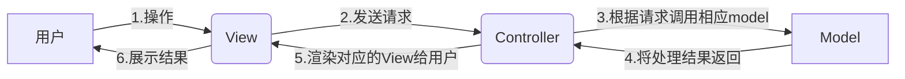

# go-mvc-demo
基于iris框架中mvc的小demo

# mvc
- Model(模型)：它是应用程序的主体部分，主要包括业务逻辑，数据操作和数据模型;
- View(视图)：用户与之交互的界面;
- Controller(控制器)：接收来自界面的请求，并交给模型进行处理；
# mvc流程

```mermaid
graph LR

A[用户] -->|1.操作| B(View)
B -->|2.发送请求| C(Controller)
C -->|3.根据请求调用相应model| D[Model]
D -->|4.将处理结果返回| C
C -->|5.渲染对应的View给用户| B
B -->|6.展示结果| A
```
